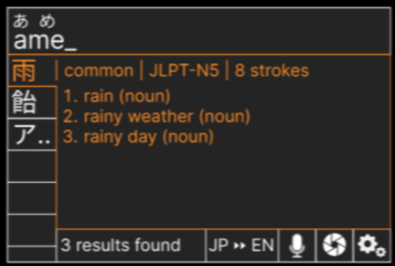

# Important
main UI file is lvgldemo.c\
nuttxspace folder reflects nuttx sim structure\
nuttxspace folder uses symlinks to reference files elsewhere in repo

# Premise
use open source LVGL library to create GUI
- modified by user input and dictionary queries
- outputs to lcd (320x240px)

# Design Reference


# Sim Setup
using nuttx sim LATEST (lvgl v9.2.2)\
using sim:lvgl_lcd

LVGL params to be set, use ```make menuconfig```
```
#define LV_USE_FONT_COMPRESSED 1
#define LV_FONT_FMT_TXT_LARGE 1
```
---
from nuttx sim to hardware
https://lvgl.io/docs/open/integration/rtos/nuttx#nuttx-on-device